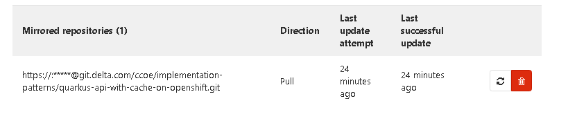
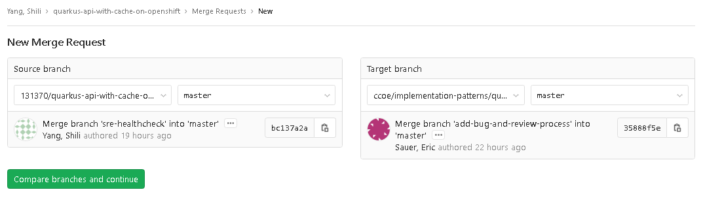

## Introduction

Instead of publishing single-purpose code samples for health-check, logging etc individually, we plan to collaborate with the CCoE Referene Architecture & Patterns team (RAP) and contribute into their samples, so that the app teams have one central location for samples that implements best practices end to end.

We use the example scenario of extending the RAP sample of [a Private API built using Quarkus and running on OpenShift](https://git.delta.com/ccoe/implementation-patterns/quarkus-api-with-cache-on-openshift) to enable a health check endpoint, and document the steps to to It. It provides details to the [Contributing guilde from the RAP repo: Getting started](https://git.delta.com/ccoe/implementation-patterns/quarkus-api-with-cache-on-openshift/-/blob/master/CONTRIBUTING.md#getting-started). 

## Step-by-step Guide

* [GitLab Docs](https://docs.gitlab.com/ee/user/project/repository/forking_workflow.html)

1. Go to the RAP code repo URL, for example, [a Private API built using Quarkus and running on OpenShift](https://git.delta.com/ccoe/implementation-patterns/quarkus-api-with-cache-on-openshift), fork the original repo
    * pick a namespace to create the forked project, use your peronsal one if you don't have access to group `ccoesre`. 
    * Wait a couple of minutes for the fork to be created, e.g. [local fork](https://git.delta.com/131370/quarkus-api-with-cache-on-openshift).
2. (Optional) Set up repository mirroring for pulling - to  keep your fork synced with the original repository
    * In your project, go to **Settings > Repository**, and then expand the **Mirroring repositories** section.
    * fill in the https URL of the original repo, e.g.`https://git.delta.com/ccoe/implementation-patterns/quarkus-api-with-cache-on-openshift.git`
    * Select `Pull` Mirror direction
    * leave everything else as is and click the `mirror repository` button.
    * the setup is complete: 
3. Baseline testing: following instructions and deploy the fork, make sure  things work as is.`For our example:
    * verify the app is running on the [OCP endpoint](http://quarkus-api-with-cache-on-openshift-sre-demo.apps.ccoe-dev.aws.delta.com/v1/greeting)
    ```
     curl http://quarkus-api-with-cache-on-openshift-sre-demo.apps.ccoe-dev.aws.delta.com/v1/greeting

    StatusCode        : 200
    StatusDescription : OK
    Content           : {"id":1,"content":"Hello, World!"}
    RawContent        : HTTP/1.1 200 OK
                        Content-Length: 34
                        Cache-Control: private
                        Content-Type: application/json
                        Set-Cookie: f43b572be25d1d49f770b53287ff2d2f=d8a58bc9973cc3d862b058b4387db666; path=/; HttpOnly

                        {"id":1,...
    ...                    
    ```
    * verify the health check endpoint is not available for the original app
    ```
    curl http://quarkus-api-with-cache-on-openshift-sre-demo.apps.ccoe-dev.aws.delta.com/health

    curl : RESTEASY003210: Could not find resource for full path:
    http://quarkus-api-with-cache-on-openshift-sre-demo.apps.ccoe-dev.aws.delta.com/health
    ...
    ```
    
4. Make and test code changes, commit to the Master branch of the local fork repo once it works successfully.
    * build and run the app locally and verify it runs locally
    * commit the code to the fork, start a pipeline run and verify the app continue to work on the ocp instance
    ```
     curl http://quarkus-api-with-cache-on-openshift-sre-demo.apps.ccoe-dev.aws.delta.com/v1/greeting

    StatusCode        : 200
    StatusDescription : OK
    Content           : {"id":1,"content":"Hello, World!"}
    RawContent        : HTTP/1.1 200 OK
                        Content-Length: 34
                        Cache-Control: private
                        Content-Type: application/json
                        Set-Cookie: f43b572be25d1d49f770b53287ff2d2f=d8a58bc9973cc3d862b058b4387db666; path=/; HttpOnly

                        {"id":1,...
    ...                    
    ```
    * verify the new health check endpoint is available and running on the new instance
      * The Quarkus health check feature enables three separate endpoints:
        * `/health/live`: the application is up and running
        * `/health/ready`:  the application is ready to serve request
        * `/health`: accumulating all health check procedures in the application;
    ```
    curl http://quarkus-api-with-cache-on-openshift-sre-demo.apps.ccoe-dev.aws.delta.com/health

    StatusCode        : 200
    StatusDescription : OK
    Content           :
                        {
                            "status": "UP",
                            "checks": [
                            ]
                        }
    RawContent        : HTTP/1.1 200 OK
                        Content-Length: 46
                        Cache-Control: private
                        Content-Type: application/json; charset=UTF-8
                        Set-Cookie: f43b572be25d1d49f770b53287ff2d2f=d8a58bc9973cc3d862b058b4387db666; path=/; HttpO...
    Forms             : {}
    Headers           : {[Content-Length, 46], [Cache-Control, private], [Content-Type, application/json; charset=UTF-8],
                        [Set-Cookie, f43b572be25d1d49f770b53287ff2d2f=d8a58bc9973cc3d862b058b4387db666; path=/; HttpOnly]}
    Images            : {}
    InputFields       : {}
    Links             : {}
    ParsedHtml        : mshtml.HTMLDocumentClass
    RawContentLength  : 46
    ```

5. Create a Merge Request (MR) to merge the code back to the RAP project.
    * set the source and target repos: 
    * add detailed description of changes made/tested
    * submit the PR.
